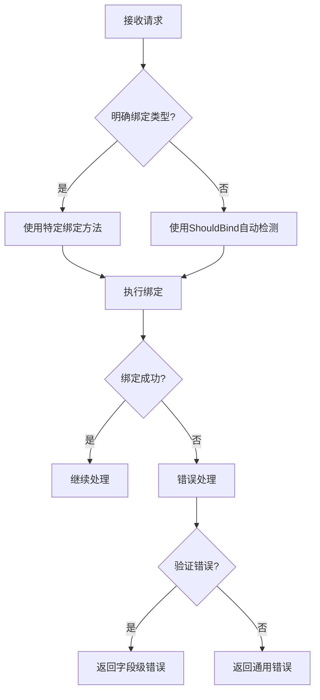

# Gin 框架 Binding 使用总结

## 一、核心绑定机制

### 1. 自动检测流程
Gin 的 `ShouldBind` 方法遵循以下检测顺序：
1. 检查 `Content-Type` 请求头
2. 根据请求方法推断：
- GET/DELETE → 优先查询 Query 参数
- POST/PUT/PATCH → 优先检查 Form 数据
3. 最终回退到 JSON 绑定

### 2. 绑定方法分类

| 类型 | 方法 | 数据源 | 特点 |
|------|------|--------|------|
| 通用 | `ShouldBind` | 自动 | 智能检测 |
| 特定 | `ShouldBindJSON` | Body | 严格JSON |
| 特定 | `ShouldBindXML` | Body | XML格式 |
| 特定 | `ShouldBindQuery` | URL | 仅查询参数 |
| 特定 | `ShouldBindUri` | URL | 路径参数 |
| 高级 | `ShouldBindBodyWith` | Body | 可重复绑定 |

## 二、Struct Tag 完全参考

### 1. 数据源映射
```go
type Example struct {
ID   string `form:"id" json:"id" uri:"id"` // 多源支持
Name string `json:"name"`                  // 仅JSON
}
```

### 2. 验证规则
```go
type User struct {
Username string `binding:"required,alphanum,min=3,max=20"`
Email    string `binding:"required,email"`
Age      int    `binding:"gte=18,lte=100"`
Password string `binding:"required,eqfield=ConfirmPass"`
ConfirmPass string `binding:"-"`
}
```

### 3. 时间处理
```go
type Event struct {
Start time.Time `time_format:"2006-01-02" binding:"required"`
End   time.Time `time_format:"2006-01-02" binding:"required,gtfield=Start"`
}
```

### 4. 嵌套结构
```go
type Order struct {
Items []Item `binding:"dive"` // 深度验证
}

type Item struct {
ID    string `binding:"required"`
Count int    `binding:"min=1"`
}
```

## 三、高级绑定模式

### 1. 多次绑定实现
```go
// 第一次绑定（缓存Body）
if err := c.ShouldBindBodyWith(&obj1, binding.JSON); err != nil {
// 错误处理
}

// 后续绑定（使用缓存）
if err := c.ShouldBindBodyWith(&obj2, binding.JSON); err != nil {
// 错误处理
}
```
**This feature is only needed for some formats – JSON, XML, MsgPack, ProtoBuf. For other formats, Query, Form, 
FormPost, FormMultipart, can be called by c.ShouldBind() multiple times without any damage to performance**

### 2. 混合绑定策略
```go
type Request struct {
ID    string `uri:"id"`          // 从路径获取
Query string `form:"query"`       // 从查询参数获取
Data  struct {
Value int `json:"value"`      // 从JSON Body获取
} `json:"data"`
}
```

### 3. 自定义验证器
```go
// 注册验证器
if v, ok := binding.Validator.Engine().(*validator.Validate); ok {
v.RegisterValidation("future", func(fl validator.FieldLevel) bool {
date, ok := fl.Field().Interface().(time.Time)
return ok && date.After(time.Now())
})
}

// 使用
type Booking struct {
Date time.Time `binding:"required,future" time_format:"2006-01-02"`
}
```

## 四、生产环境最佳实践

### 1. 安全防护
```go
// 限制请求体大小（放在路由开头）
const maxBodyBytes = 8 * 1024 * 1024 // 8MB
c.Request.Body = http.MaxBytesReader(c.Writer, c.Request.Body, maxBodyBytes)
```

### 2. 错误处理模板
```go
if err := c.ShouldBind(&input); err != nil {
if verr, ok := err.(validator.ValidationErrors); ok {
errors := make(map[string]string)
for _, fe := range verr {
errors[fe.Field()] = translateError(fe)
}
c.JSON(400, gin.H{"errors": errors})
return
}
c.JSON(400, gin.H{"error": "invalid request"}))
return
}
```

### 3. 性能优化
- 高频API避免使用 `ShouldBindBodyWith`
- 简单查询优先使用 `ShouldBindQuery`
- 大文件上传使用单独处理流程

## 五、常见问题解决方案

### 1. 空值处理
```go
type Config struct {
Enable *bool `json:"enable"` // 使用指针区分零值
}
```

### 2. 时间格式冲突
```go
type Record struct {
// 明确指定时间格式
CreatedAt time.Time `json:"created_at" time_format:"2006-01-02 15:04:05"`
}
```

### 3. 多语言错误消息
```go
func translateError(fe validator.FieldError) string {
switch fe.Tag() {
case "required":
return "该字段为必填项"
case "email":
return "请输入有效的邮箱地址"
// 更多自定义翻译...
}
return fe.Error()
}
```

## 六、完整工作流程图



通过本指南，您可以：
1. 掌握所有绑定方法和使用场景
2. 正确使用 struct tag 控制绑定行为
3. 实现安全高效的请求数据处理
4. 构建健壮的错误处理机制
5. 优化绑定性能

记住关键原则：**明确胜于隐式**，在关键业务场景中优先使用特定绑定方法而非自动检测。
